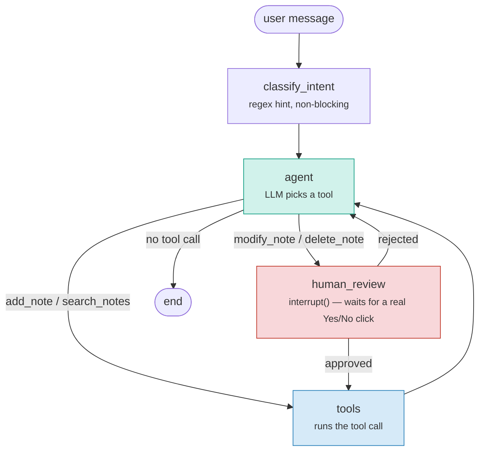

# Conversational Note-Taking Agent

A small LangGraph agent that manages notes through chat: add, search, update,
delete, all through natural language, backed by Groq for the LLM.

## Project layout

```
agent.py               core logic: DB, tools, intent classifier, graph
main.py                CLI entrypoint
ui.py                  Streamlit chat UI with Yes/No confirmation buttons
test_agent_smoke.py    smoke test using a stubbed LLM (no API key needed)
requirements.txt
TEST_CASES.md          manual + automated test scenarios with expected results
```

`agent.py` is the only file that matters architecturally — both `main.py`
and `ui.py` just call `build_app()` from it and drive the graph.

## How it's put together

**The database** is SQLite (`NoteDatabase`, default file `notes.db` in the
working directory, overridable via `NOTES_DB_PATH`). It persists across
restarts — the seed notes only get inserted the first time the file is
empty, so re-running the app doesn't wipe or duplicate data.

**Tools** wrap the database for the LLM: `add_note`, `search_notes`,
`modify_note`, `delete_note`. `add_note` and `search_notes` execute
immediately, no gate needed. `modify_note` and `delete_note` also just
run directly against the database — that's safe specifically *because* of
where they sit in the graph (see below): by the time either of them is
actually invoked, a human has already approved it.

**Confirmation is a real pause, not text parsing.** When the model proposes
a `modify_note`/`delete_note` call, the graph routes to a `human_review`
node that calls LangGraph's `interrupt()`. This freezes execution —
`app.invoke()` returns immediately with the run paused and a payload
describing exactly what would change. Nothing happens to the database until
the caller resumes with `Command(resume={"approved": True/False})`. The CLI
prompts for `yes`/`no` in the terminal; the Streamlit UI renders actual
**Yes/No buttons** and disables the regular chat box until one is clicked.
There's no regex trying to guess whether "yeah go for it" means yes —
the decision is an explicit boolean the caller supplies, sourced from a
real click (or an explicit CLI answer), not from interpreting free text.

If the model proposes more than one destructive change in the same turn
(e.g. delete note A and rename note B together), both are bundled into one
confirmation and approved or rejected as a unit — this keeps the
tool-call/tool-result bookkeeping simple and avoids a whole class of
ordering bugs that shows up with strict OpenAI-style tool-calling APIs.

**The intent classifier** (`classify_intent`) is a small regex/keyword
matcher that tags each message as create/search/modify/delete/chitchat and
adds a short hint to the system prompt. It's advisory only now — since
confirmation is handled by the interrupt above, the classifier is no longer
responsible for deciding anything safety-critical, just for nudging the
model toward the right tool.

## Graph flow



The only edge that leads into `human_review` comes from `agent` proposing a
destructive tool call. The only way out of `human_review` toward `tools`
(i.e. toward an actual database write) is the `approved` branch — and that
branch only fires from a resumed `interrupt()`, which only happens when the
caller explicitly supplies `approved: True`. That's the entire safety
argument in one diagram: there is no path from raw model output to a
database mutation that skips the human click.

## Running it

Using `uv`:

```bash
uv venv
uv pip install -r requirements.txt
```

Add your Groq key — either export it or drop a `.env` file in the project
root:

```
GROQ_API_KEY=your_key_here
```

Then run whichever entrypoint you want:

```bash
uv run python main.py              # terminal chat, y/n prompt for confirmations
uv run streamlit run ui.py         # browser chat, real Yes/No buttons
uv run python test_agent_smoke.py  # sanity check, no API key required
```

If you're not using `uv`, the equivalent is a normal venv + `pip install -r
requirements.txt`, then `python main.py` / `streamlit run ui.py`.

## The UI

`streamlit run ui.py` gives you a plain chat box. When the agent proposes a
modify or delete, the chat input disables itself and a warning card with
**✅ Yes, proceed** / **❌ No, cancel** buttons appears — you have to
resolve it before you can type anything else. Under each reply there's also
a "Tool calls & intent" expander showing the classified intent and every
tool call made that turn, for debugging. The sidebar has a live dump of the
notes currently in the database and a reset button (resets the
conversation only — notes persist independently).

It's single-session by design (one fixed thread id, one shared DB) — good
for local testing, not built for multiple concurrent users.

## Known gaps

- Single-user/single-session — one fixed `thread_id`, one shared DB connection.
- SQLite with a single connection + a lock handles one user fine; it is not built for concurrent writers.
- The intent classifier is a heuristic and will misfire on unusual phrasing — acceptable since it's advisory only now, not gating anything.
- No audit log — a confirmed delete is just gone, no record of who approved it or when.
- No auth — anyone with the URL/terminal has full read/write/delete access.
